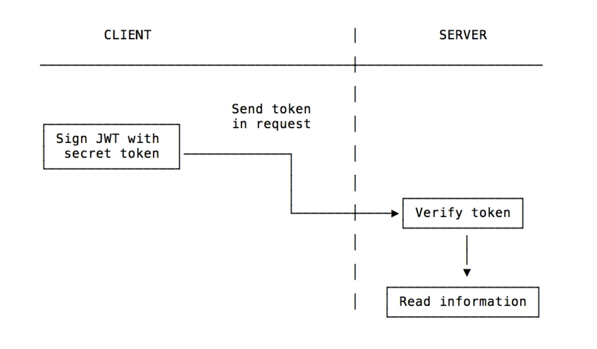

# Title: Vav

## Subtitle: MyPet

## Semester: Spring 2020

## Overview

The main idea of our website is to help people who love pets take care of their pets. For example, many times pet owners cannot travel or have insufficient time to take care of their pets. Our user could use pet service to solve this problem. Pet service means a user can provide pet service to other users.  

## Team Members

Team member names with their GitHub usernames.

- Peilin Guo: perryguo98

- Ziwei Hu: ZiweiHu1015

- Yi Sha: Candyexplode

## Important

- http://mypet-final-web.herokuapp.com (only click this url, this is the app of front-end)
- http://mypet-final-server.herokuapp.com (the app for back-end, because we use two ports for the whole app)
- In order to build two apps on heroku, we made two new repositories on GitHub. (https://github.com/Candyexplode/final-server.git & https://github.com/Candyexplode/final-web.git) We moved our code from the old repository to these two new repositories.

## User Interface

### User's Profile


On this webpage, users can view their personal information and manage their pets' information. Although their pets' information can not see by other users, the future, we (our website) can collect and analyze these data to help improve our website's service.

### List of Users


On this webpage, users can edit their personal information and view other users' information. Users can also use the information from this webpage to find and contact other users.

### Posts


On this webpage, users can post their pet services and view all posts. Also, users can search other's services by specific city names to find nearby services. Users can only delete their own posts.

## APIs

### restful API for sign-in

| Method | Describe |
| :----- | :-------:|
| POST | Submit username and password to the server, then API calls data from database to match |

### restful API for sign-up

| Method | Describe |
| :----- | :-------:|
| POST | Create the data of user's information and then submit to the server, API stores it to the database |

### restful API for users

| Method | Describe |
| :----- | :-------:|
| GET | Get all users' data |
| POST | Update users' data |
| PATCH | Partial update users' data (edit function) |
| DELETE | Delete specific user's data (/users/:id) |
| GET | Get specific user's data (/users/:id) |

### restful API for posts

| Method | Describe |
| :----- | :-------:|
| GET | Get all posts' data |
| GET | Get specific post's data (/posts/:id) |
| GET | Get specific post's data by keywords (search function) (/posts/filter/:filter) |
| POST | Update posts' data |
| PATCH | Partial update post's data (edit function) |
| DELETE | Delete specific post's data (/posts/:id) |

### restful API for pets

| Method | Describe |
| :----- | :-------:|
| GET | Get all pets' data |
| GET | Get specific pet's data (/pets/:id) |
| POST | Update pets' data |
| PATCH | Partial update pet' data (edit function) |
| DELETE | Delete specific pet's data (/pets/:id) |

## Database

- We use TypeScript Built-in data type "any" for our variables. If variable is declared with any data-type then any type of value can be assigned to that variable. 

### User document

```json
{
    _id: ObjectID
    username: any, // name of the user
    password: any, // password of user
    firstname: any, // user's first name
    lastname: any, // user's lastname
    birthdate: any, // user's birthdate
    email: any, // user's email
    memo: any, // user's memo to show other users
}
```
  
### Pet document

```json
{
    _id: ObjectID
    name: any, // dog's name
    gender: any, // dog's gender
    age: any, // dog's age
    species: any, // dog's species
}
```

### Post document

```json
{
    _id: ObjectID
    firstname: any, // user's first name for this pet service
    lastname: any, // user's last name for this pet service
    city: any, // user's city for this pet service
    content: any, //  content for this pet service
    userId: ObjectId, // this is same user id in ObjectID
}
```

## URL Routes/Mappings

### Permissions

If people want to use our website and they are the first time to enter our website, it will automatically jump to the log-in page and ask users to log in. After logging in, users could access every webpage.

### Authentication

Only /sign-in and /sign-up pages do not need user authentication.

### Routes

| Route | Describe |
| :----- | :-------:|
| / | Home page |
| /sign-in | User needs to log into our website first  |
| /sign-up | If users do not have an account, they need to sign up |
| /users | users can see the list of basic informations of all users| 
| /posts | users can post and see others' posts here | 
| /pets |  users can add pets | 
| /users/:id | allows users to edit user information base on user's id. | 
| /posts/:id | Delete user's own specific post | 
| /posts/filter/:filter |  allow users find a post base on key words| 
| /pets/:id |  allows users to edit pet's information base on pet's id| 

## Authentication/Authorization

### Authentication

We use JWT for user authentication.

A JWT is a mechanism to verify the owner of some JSON data. It's an encoded string, which is URL safe, that can contain an unlimited amount of data, and it's cryptographically signed. When a server receives a JWT, it can guarantee the data it contains can be trusted because it's signed by the source. No middleman can modify a JWT once it's sent.

Once the user is logged in, each subsequent request will include the JWT, allowing the user to access routes, services, and resources that are permitted with that token. Single Sign-On is a feature that widely uses JWT nowadays, because of its small overhead and its ability to be easily used across different domains.



### Authorization

The users who have logged in can edit their information at the Users List website, create their pets' information, and add/delete their posts at the Post website. Although users can see others' information and posts, they can not successfully change other users' information and delete other users' posts. Others' data will not change, although users click the Edit or Delete button. For debugging, we also add messages to show on the console if a user tries to change or delete other's information or post.

## Division of Labor

### Yi Sha

Making all website about the users and pets, including login/logout, signup, profile, and pet list. Also making an website for clients to contact other users called Users List. Implementating all back-end code and front-end for these websites. Writing markdown file.

### Peilin Guo

Making Petservice Back-end  Code and Front-end Implementation. Making  and implementating database skeleton code for petservice part. implementing the Frount-end and test  service part. Writing markdown file. Making video.

### Ziwei Hu

Whole website skeleton including the top navigation bar, the drop-down meanu, the warp-screen effect, and the posting page. front-end implementation, database back-end implementation, writing final-markdown file,record video. 

## Conclusion

We faced a lot of problems during working on the project. The biggest challenge is that we can't discuss problems face to face, one of our team members is in a different time zone which has 12 hours of time difference. The most important thing we learned is how to teamwork.

Despite all challenges, we have the project done and achieved most of the functionalities. We all learned how to build a website and connect to the server and build a database. When we design the website, we have a lot of ideas, and we wanted to implement all of them. But if we are too obsessed with making all ideas work, the website will be crowded and lost its focus. We realized that we need to have several main functionalities for the website, and delate confusing ones. 

We would like to know how social media like Facebook handle the traffic since there are so many users. Before the start of the project, if I could have an example of a website, it would really help us. We didn't know how to connect everything together, it took us a long time to figure out. 
