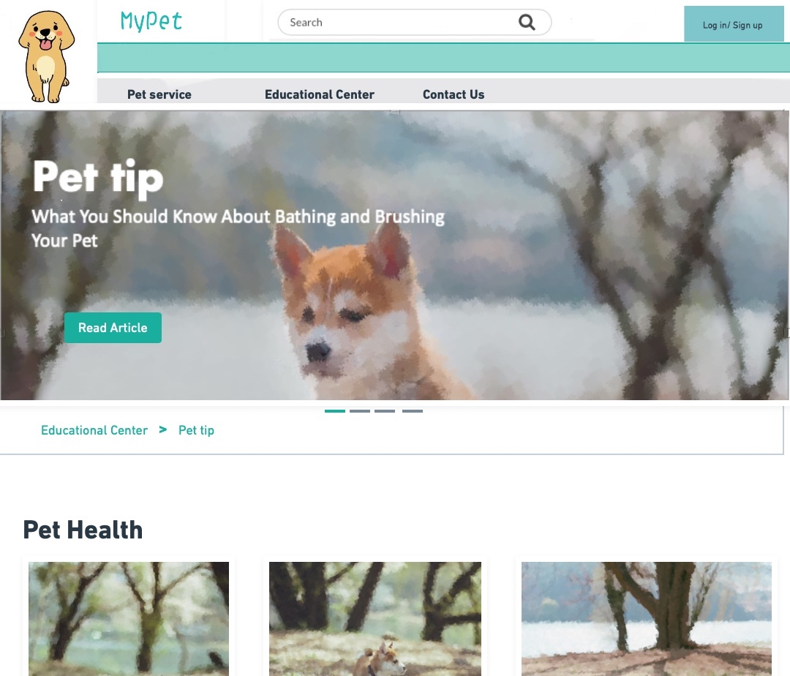
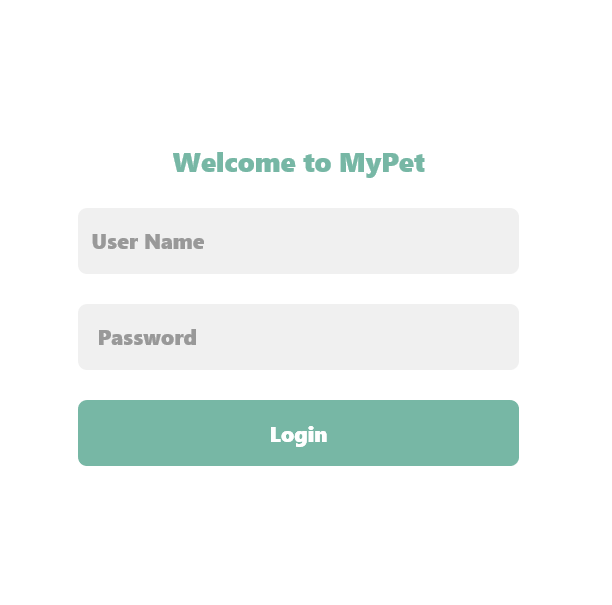
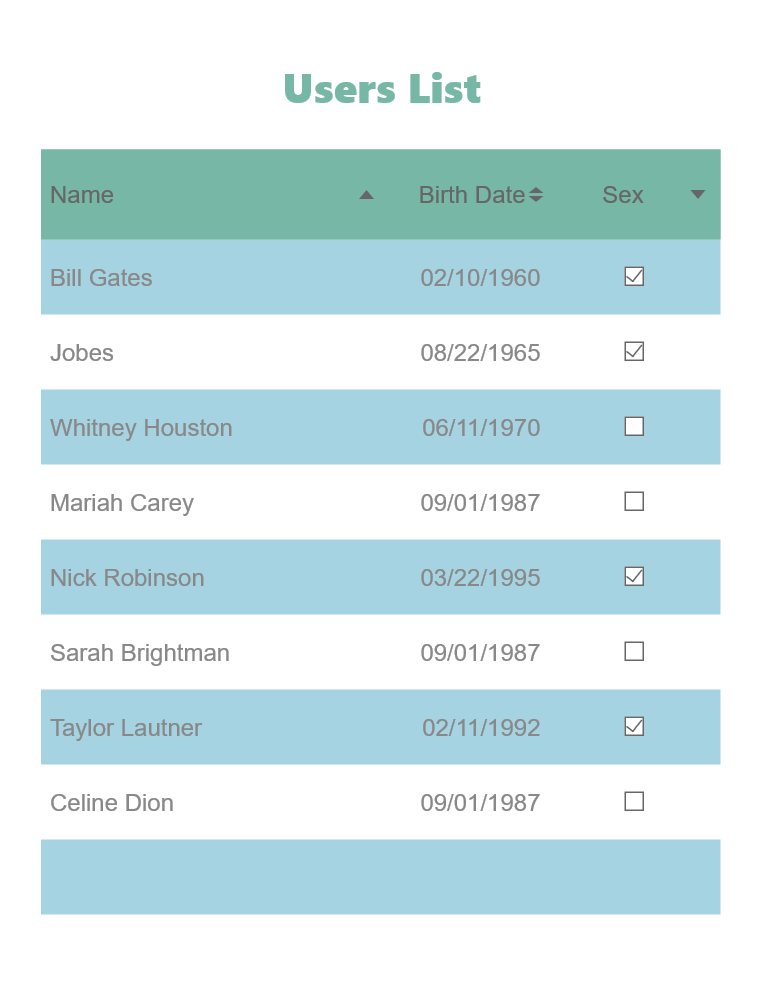

#Wrok Breakdown:
Peilin Guo:Peilin Guo: Making a common header and footer. Making Navigation bar, sliding album. Making Homepage, educational center page, and about us page.
Ziwei Hu: Making Navigation bar, background picture, and text, posting area, and posting form. Making a pet service page.
Yisha: Making log in page, User list page, and User profile page.

#Part 1 WireFrame 
* Main page: The two images below are the wireframes of the myPet website. 

The picture above is the wireframe for petService page. This page includes the users's posts and a post form. 

* Educational Center:

* Login page:

* Signup page:

* User Information page:

* Users List page:

#Part 2:HTML and CSS

 *Home page:
 The homepage helps the user be familiar with our website and other users on the website. There is a sliding album that shows our website's user's pet photo. On the home page, the user can see footer. It has images and our website logo and text describing our website.

 *Educational Center:
 Educational center on this site offers REALLY useful tips to users - from what shots your dog should have, to tricks when taking your cat to the vet, as well as tips of cleanning your bunny's house/cage/nest
 
 *About Us page:
The primary purpose of about us page is helping users know what to expect on our webpage and who made this webpage. Users can understand the basic ideas of our website and its goals and mission by reading about us page.

 *PetService1:
 
The above image is a screenshot of myPet's pet service page. On the top there are navigations bars that can take you to other pages of the website. Below the navigation bar, there is a big background picture and a greeting message on the top. 

*PetService2:
 
Below the background picture, it's users' posting area. User's post will appre in this area. Users' can see other people's profile picture, a service title and a description message of their service. 

*PetService3:
 
 The above image is the posting form. Users can enter their name and location, and a brief message that descripts their service. Users can choose to includ a title in their description. 

* Log In page:
 

* Sign Up page:
 

* Profile page:
 
 Future, I will change this page to a pop-up page. 

* User List page:
 
 Users can post their on Memo part of profile page, and users can check and send emails to the person who can help according to their skills. Users can click "User Name" to see the profiles.
