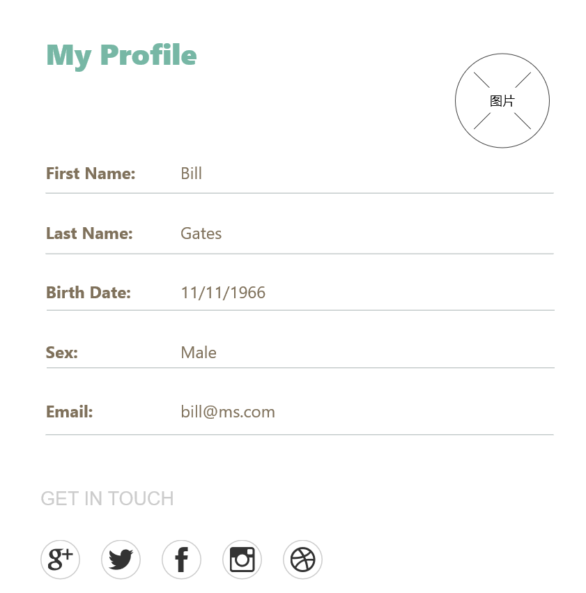

 #Part 1 WireFrame 
* Main page: The two images below are the wireframes of the myPet website. 

The picture above is the wireframe for petService page. This page includes the users's posts and a post form. 

* Educational Center:

* Login page:

* Signup page:

* User Information page:

* Users List page:

#Part 2:HTML and CSS

 *main page:

 *Educational Center:

 *PetService1:
 
The above image is a screenshot of myPet's pet service page. On the top there are navigations bars that can take you to other pages of the website. Below the navigation bar, there is a big background picture and a greeting message on the top. 

*PetService2:
 
Below the background picture, it's users' posting area. User's post will appre in this area. Users' can see other people's profile picture, a service title and a description message of their service. 

*PetService3:
 
 The above image is the posting form. Users can enter their name and location, and a brief message that descripts their service. Users can choose to includ a title in their description. 

