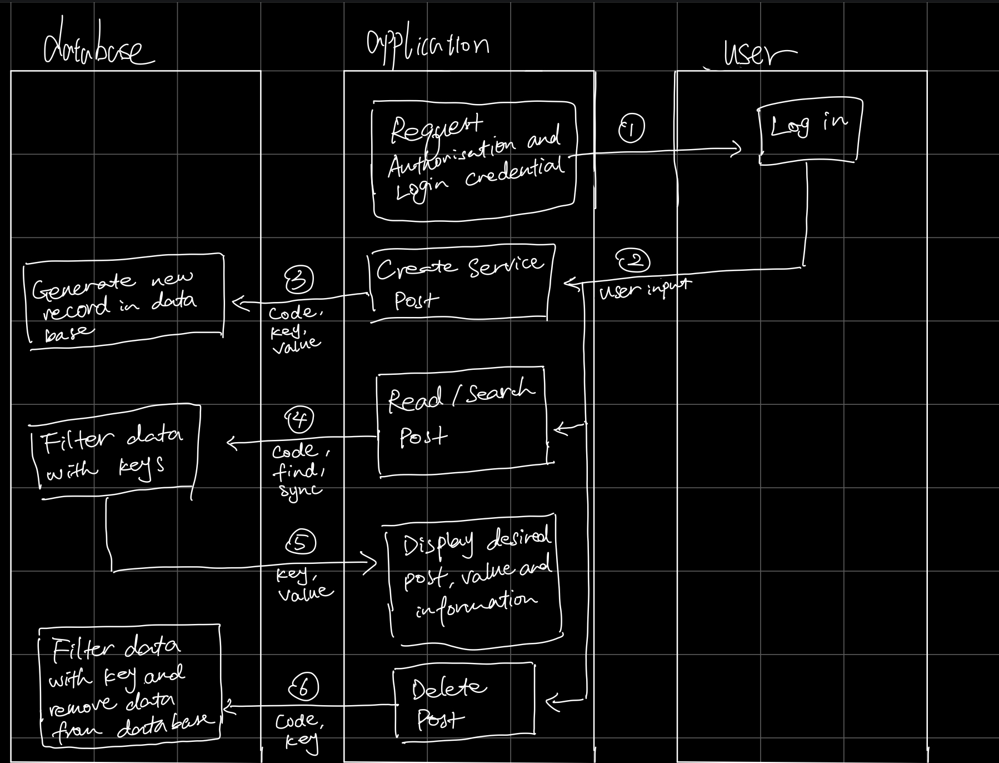

# MyPet
# Work Breakdown:
* Peilin Guo:Peilin Guo: Making Back-end Skeleton Code and Front-end Implementation. Writing md file. Helping implement database code.
* Ziwei Hu: Making Navigation bar, background picture, and text, posting area, and posting form. Making a pet service page.
* 

* Part 0: Project API Planning

API flowcharts:

* Part 2: Front-end Implementation

* Create 
Parameter
Description

Fname
(Required) The first name for the newly created user counter

Lname
Required) The last name for the newly created user

City
(Required) The city name for the newly created counter city name

example:

Responses
The create API returns all response data as a JSON object. 
The interface will create a post for user to our database. 

* Update:
The update provides a way for the clients to update their previous posts. They can update the first name, last name, city and value.

There are three requirement parameters and zero optional parameters for this endpoint. 

Parameter
Description
Example
FName
(Required) The first name for the newly created server content
LName 
(Required) The last name for the newly created server content
City
(Required) The city name of the service server content
content 
(Required) The service post message by the user to replace the default or previous post

Example

Responses:
If users do not have server content before, update will help them to add their server content 
If users have server coentent before,update will help them to change their server content

* read
The read  provides a way for the clients to get post information by providing first name, last name and city name.

There are three required parameters and zero optional parameters for this endpoint.

Parameter
Description
Fname
(Required) The first name for the newly created user counter

Lname
(Required) The last name for the newly created user

City
(Required) The city name for the newly created counter city name

Example

Responses:
The read endpoint outputs “You already have a post with message: + value.” if there is a post that exists. The endpoint outputs “You haven't posted any services yet, please create a new one.” if there is no post existing.

